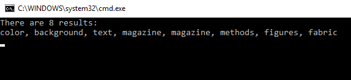

# DL.IQ.WordSearch
Interview Question: Given a 2-dimension data containing characters and a list of valid words, find a list of valid words from the data.

For example, if the input data looks like this:

and the list of valid words looks like this:

,

the program should return

